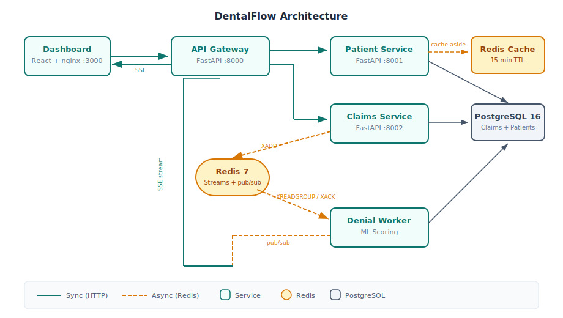

# DentalFlow

Async dental claims processing pipeline with ML-based denial prediction.

## Problem

Dental practices lose 15-30% of revenue to preventable claim denials — missing X-rays, wrong CDT codes, exceeded annual maximums. Small practices (1-3 staff) can't afford enterprise RCM software. DentalFlow catches denial risks before submission.

## Architecture



6 containers: React dashboard, API gateway, patient service, claims service, denial prediction worker, and shared PostgreSQL + Redis infrastructure. Claims flow synchronously through the gateway to the claims service, then asynchronously through Redis Streams to the ML-powered denial worker. Results push back to the dashboard in real time via Redis pub/sub and SSE.

**[Live Demo](https://dentalflow-demo.example.com)**

## What It Demonstrates

| Concept | Implementation | Location |
|---------|---------------|----------|
| Microservices | 6 independently deployable containers | `docker-compose.yml` |
| API Gateway | Request routing, rate limiting, correlation IDs | `gateway/main.py` |
| Cache-aside | Redis eligibility cache with 15-min TTL | `patient_service/main.py` |
| Message queue | Redis Streams with consumer groups, XREADGROUP/XACK | `denial_worker/main.py` |
| Idempotency | DB-level UNIQUE constraint on client-generated keys | `claims_service/main.py` |
| At-least-once delivery | ACK only after DB persist | `denial_worker/main.py` |
| Stuck message recovery | Background job republishes stale claims | `claims_service/main.py` |
| Real-time updates | SSE via Redis pub/sub | `gateway/main.py` |
| ML inference pipeline | Trained GradientBoosting model loaded at worker startup | `denial_worker/main.py` |
| Graceful degradation | Rate limiter fails open when Redis is down | `gateway/main.py` |

## Quick Start

```bash
git clone https://github.com/rrobin711/dentalflow.git
cd dentalflow
make train        # Train the ML denial prediction model
make build        # Build and start all 6 containers
make health       # Verify everything is running
# Open http://localhost:3000 for the dashboard
make demo         # Or run the CLI demo
make test         # Run tests
```

## Tech Stack

- **Backend**: Python 3.12, FastAPI, asyncpg, redis.asyncio
- **ML**: scikit-learn GradientBoostingClassifier trained on synthetic dental claims data
- **Database**: PostgreSQL 16 (claims, patients, eligibility audit trail)
- **Cache/Queue**: Redis 7 (cache-aside, Streams with consumer groups, pub/sub)
- **Frontend**: React 18, TypeScript, Tailwind CSS, SSE for real-time updates
- **Infrastructure**: Docker Compose, nginx reverse proxy

## Design Decisions

**Redis Streams over Kafka** — Same consumer group semantics (XREADGROUP, XACK, pending entry list) at the right scale. Kafka's partition-level parallelism and multi-datacenter replication aren't needed here.

**Sync claim creation, async scoring** — The front desk gets instant confirmation that the claim was received. ML inference happens in the background. This matches the real workflow: you don't make a patient wait while the system scores their claim.

**Money as integer cents** — `150000` = $1,500.00. Eliminates floating-point rounding errors in claim amounts. Every dental billing system does this.

**SSE over WebSockets** — The dashboard only needs server-to-client push for claim status updates. SSE is simpler, works through HTTP proxies, and auto-reconnects natively.

**Database-level idempotency** — UNIQUE constraint on `idempotency_key` column. No distributed locks, no Redis-based dedup. The database is the source of truth. On conflict, return the existing record.

**At-least-once delivery with DB-first persistence** — The worker writes scoring results to PostgreSQL before acknowledging the message. If the worker crashes between DB write and ACK, the message gets redelivered and the worker processes it again (idempotently).

**Fail-open rate limiting** — If Redis is down, the rate limiter allows requests through. For a dental practice tool, availability matters more than strict rate enforcement.

## Running Tests

```bash
make build        # Services must be running
make test         # pytest tests/ -v
```

Tests cover the full pipeline: health checks, patient CRUD, eligibility with cache verification, claim creation with CDT validation, idempotency, denial scoring at multiple risk levels, rate limiting, and the ML model unit tests.

## Project Context

Built as a portfolio project demonstrating distributed systems patterns (microservices, message queues, cache-aside, idempotency, graceful degradation, real-time streaming) and as a prototype for a dental RCM startup targeting small independent practices.
